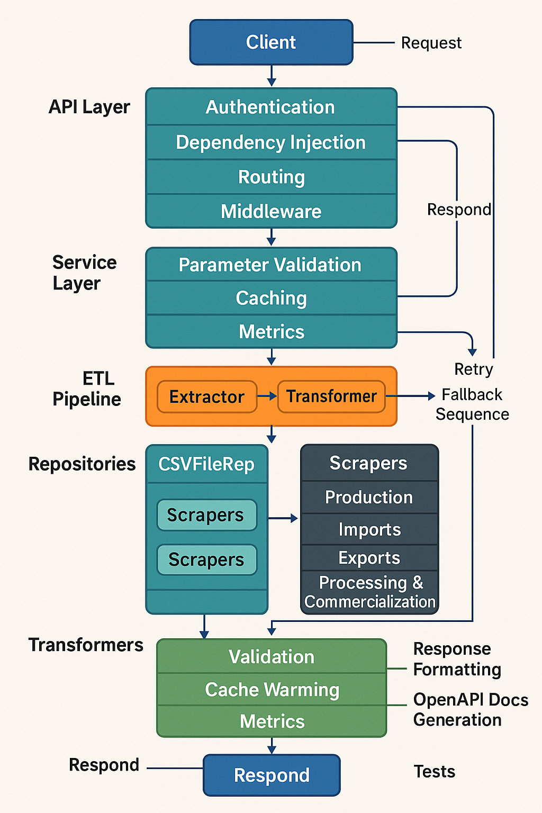

# VitiBrasil API


[](https://github.com/argusportal/viticultureapi/stargazers)

API RESTful para dados da indústria vitivinícola brasileira. Extraindo, processando e disponibilizando informações da Embrapa.

🚀 **API em produção**: [https://viticultureapi.onrender.com](https://viticultureapi.onrender.com)
- **Documentação Swagger**: [https://viticultureapi.onrender.com/docs](https://viticultureapi.onrender.com/docs)
- **Documentação ReDoc**: [https://viticultureapi.onrender.com/redoc](https://viticultureapi.onrender.com/redoc)


## 📋 Sumário

- [📂 Estrutura do Projeto](#-estrutura-do-projeto)
- [⚡ Início Rápido](#-início-rápido)
- [🌟 Recursos](#-recursos)
- [🔧 Instalação](#-instalação)
- [🚀 Uso](#-uso)
- [📝 Documentação da API](#-documentação-da-api)
- [⚙️ Arquitetura](#️-arquitetura)
- [🧩 Componentes Principais](#-componentes-principais)
- [🔍 Desafios e Soluções](#-desafios-e-soluções)
- [🔄 Cache e Performance](#-cache-e-performance)
- [🛠️ Tecnologias](#️-tecnologias)
- [👥 Contribuição](#-contribuição)
- [📄 Licença](#-licença)

## 📂 Estrutura do Projeto

A ViticultureAPI segue uma estrutura organizada baseada em camadas para facilitar a manutenção e escalabilidade:

```
viticultureapi/
├── app/                    # Código principal da aplicação
│   ├── __init__.py
│   ├── main.py             # Ponto de entrada da aplicação
│   ├── api/                # Endpoints da API
│   │   ├── __init__.py
│   │   ├── api.py          # Router principal
│   │   └── endpoints/      # Implementações dos endpoints
│   │       ├── __init__.py
│   │       ├── auth.py
│   │       ├── production.py
│   │       ├── imports.py
│   │       ├── exports.py
│   │       ├── processing.py
│   │       └── commercialization.py
│   ├── core/               # Funcionalidades de núcleo
│   │   ├── __init__.py
│   │   ├── config.py       # Configurações globais
│   │   ├── cache/          # Sistema de cache
│   │   ├── exceptions.py   # Tratamento de exceções
│   │   ├── logging.py      # Sistema de logs
│   │   ├── middleware.py   # Middlewares
│   │   ├── pipeline.py     # Framework de pipeline ETL
│   │   ├── security.py     # Autenticação e segurança
│   │   └── validation/     # Sistema de validação
│   ├── models/             # Modelos de dados (Pydantic)
│   │   ├── __init__.py
│   │   ├── base.py
│   │   ├── production.py
│   │   └── ...
│   ├── scraper/            # Sistema de scraping
│   │   ├── __init__.py 
│   │   ├── base_scraper.py
│   │   ├── production_scraper.py
│   │   └── ...
│   ├── services/           # Serviços de negócios
│   │   ├── __init__.py
│   │   ├── interfaces.py
│   │   └── ...
│   ├── transform/          # Transformadores de dados
│   │   ├── __init__.py
│   │   └── ...
│   └── utils/              # Utilidades gerais
│       ├── __init__.py
│       └── data_cleaner.py
├── data/                   # Arquivos de dados
│   ├── raw/                # Dados brutos
│   └── processed/          # Dados processados
├── docs/                   # Documentação detalhada
│   ├── images/
│   ├── detalhamento_main.md
│   ├── detalhamento_transform.md
│   ├── detalhamento_utils.md
│   ├── detalhamento_tests.md
│   └── ...
├── tests/                  # Testes automatizados
│   ├── __init__.py
│   ├── test_cache.py
│   ├── test_scraper.py
│   └── ...
├── .env.example            # Exemplo de variáveis de ambiente
├── requirements.txt        # Dependências do projeto
├── LICENSE                 # Arquivo de licença
└── README.md               # Este arquivo
```

## ⚡ Início Rápido

```bash
# Clonar o repositório
git clone https://github.com/argusportal/viticultureapi.git
cd viticultureapi

# Configurar ambiente virtual
python -m venv venv
source venv/bin/activate  # Linux/Mac
# ou
venv\Scripts\activate     # Windows

# Instalar dependências
pip install -r requirements.txt

# Executar a API
uvicorn app.main:app --reload

# Acesse a documentação Swagger
# http://localhost:8000/docs
```

## 🌟 Recursos

- **🍇 Dados Abrangentes**: Produção, processamento, importação, exportação e comercialização de produtos vitivinícolas
- **🔄 HATEOAS**: API RESTful nível 3 com navegação hipermídia
- **💾 Cache Inteligente**: Sistema de cache multi-nível para otimização de performance
- **📊 Fallback Automático**: Mecanismo para garantir disponibilidade contínua dos dados
- **🔍 Validação Robusta**: Sistema avançado de validação tipo-seguro
- **📖 Documentação Interativa**: Interface Swagger UI personalizada

## 🔧 Instalação

### Requisitos

- Python 3.10+
- Dependências listadas em `requirements.txt`

### Instalação Manual

```bash
# Clonar o repositório
git clone https://github.com/argusportal/viticultureapi.git
cd viticultureapi

# Configurar ambiente virtual
python -m venv venv
source venv/bin/activate  # Linux/Mac
# ou
venv\Scripts\activate     # Windows

# Instalar dependências
pip install -r requirements.txt

# Configurar variáveis de ambiente (opcional)
cp .env.example .env
# Edite o arquivo .env conforme necessário

# Executar a API
uvicorn app.main:app --reload
```

## 🚀 Uso

### Exemplos de Requisições

```python
import requests

# Obter dados de produção de vinhos para 2022
response = requests.get("http://localhost:8000/api/v1/production/wine?year=2022")
# Ou use a API em produção:
# response = requests.get("https://viticultureapi.onrender.com/api/v1/production/wine?year=2022")
data = response.json()
print(f"Total de registros: {data['count']}")

# Dados de importação
response = requests.get("http://localhost:8000/api/v1/imports/")
imports_data = response.json()

# Exportação de sucos
response = requests.get("http://localhost:8000/api/v1/exports/juice")
juice_exports = response.json()
```

### Formato de Resposta

```json
{
  "data": [
    {
      "Produto": "Vinho Tinto",
      "Quantidade": "156.789.431",
      "Ano": 2022
    },
    // ... outros registros
  ],
  "count": 25,
  "ano_filtro": 2022,
  "source_url": "http://vitibrasil.cnpuv.embrapa.br/index.php?opcao=opt_02&subopcao=subopt_01",
  "source": "web_scraping",
  "_links": {
    "self": {"href": "/api/v1/production/wine?year=2022"},
    "prev_year": {"href": "/api/v1/production/wine?year=2021"},
    // ... outros links HATEOAS
  }
}
```

## 📝 Documentação da API

Acesse a documentação interativa da API:

- **API em Produção**: [https://viticultureapi.onrender.com](https://viticultureapi.onrender.com)
- **Swagger UI (Produção)**: [https://viticultureapi.onrender.com/docs](https://viticultureapi.onrender.com/docs)
- **ReDoc (Produção)**: [https://viticultureapi.onrender.com/redoc](https://viticultureapi.onrender.com/redoc)

Para ambiente local após iniciar a aplicação:
- **Swagger UI (Local)**: [http://localhost:8000/docs](http://localhost:8000/docs)
- **ReDoc (Local)**: [http://localhost:8000/redoc](http://localhost:8000/redoc)

## ⚙️ Arquitetura

Este projeto foi desenvolvido para o **Tech Challenge** da Pós-Graduação em **Machine Learning Engineering** da FIAP.

A arquitetura da VitiBrasil API é organizada em camadas, seguindo princípios de **Clean Architecture** e padrões **SOLID**:

<!-- DIAGRAMA DE ARQUITETURA - SERÁ INSERIDO MANUALMENTE -->
[Espaço reservado para o diagrama de arquitetura]

### Fluxo de Dados



O sistema é estruturado nas seguintes camadas principais:

* **API Layer**: Endpoints REST e Middlewares
* **Service Layer**: Lógica de negócio, Transformers e Validation
* **Repository Layer**: Repositories e Scrapers 
* **Core**: Pipeline ETL, Cache, Logging e Exceptions
* **Data Sources**: Web Scraping, CSV Files e External APIs

## 🧩 Componentes Principais

### Sistema de Validação

Componente crítico para garantir a **integridade dos dados**. Foi aprimorado para ser **tipo-seguro**, incluindo verificações explícitas para valores nulos e NaN, compatibilidade com análise estática e mensagens de erro descritivas.

* Define interfaces: `ValidationSeverity`, `ValidationIssue`, `ValidationResult`, `Validator`.
* Implementa **validadores específicos** para Strings, Números, Datas, Listas, Dicionários e DataFrames.
* Conta com **Normalizadores** para limpar e padronizar dados.
* Relatórios de validação podem ser gerados. Integra-se ao pipeline ETL.

### Sistema de Cache

Reforçado para maior **robustez** e resiliência. Possui um decorador `@cache_result` com configuração flexível (TTL, tags, provider). Inclui **medição de performance** e tratamento aprimorado de exceções com **fallback automático** para execução direta se o cache falhar.

* Suporta múltiplos provedores como **Memory**, **Redis** e **File**.
* Essencial para **otimizar o desempenho** em produção.
* Utiliza interfaces comuns e o padrão Factory para gerenciar provedores.

### Sistema de Scraping

Responsável pela extração de dados do site VitiBrasil da Embrapa. Baseado em uma classe `BaseScraper` com infraestrutura comum (sessão HTTP robusta com retry, extração de tabelas, fallback para CSV, limpeza de dados).

* Possui **scrapers especializados** para Produção, Importação e Exportação.
* Lida com problemas comuns como setas de navegação e conversão segura de números.
* É integrado ao sistema de cache.
* Apresenta **robustez** com retry automático, seleção inteligente de tabelas e limpeza de dados detalhada.

### Repositórios

Implementam o **padrão Repository**. Definem interfaces abstratas para um contrato claro e baixo acoplamento. Incluem um `FileRepository` para manipular arquivos (CSV, Excel) e um `ScrapingRepository` robusto para extração web.

* Repositórios especializados existem para domínios como Produção e Importação.
* O padrão Repository facilita o **mecanismo de fallback para CSV** e a substituição de fontes de dados.
* São consumidos pela camada de Serviço.

### HATEOAS Implementation

A API alcança o **nível 3 de maturidade REST** com a implementação do HATEOAS:

* **ResponseEnricher**: Middleware que adiciona links _HAL a todas as respostas
* **LinkGenerator**: Gera links apropriados com base no tipo de recurso
* **RelationshipManager**: Gerencia relações entre diferentes recursos

**Benefícios**:
* **Desacoplamento total**: Clientes não precisam conhecer URLs específicas
* **Evolução flexível**: Endpoints podem ser reorganizados sem quebrar clientes
* **Descoberta automática**: Clientes podem navegar pela API seguindo links
* **Autodescrição**: A API descreve suas próprias capacidades e relações

## 🔍 Desafios e Soluções

### Inconsistência nos Dados de Origem

**Desafio**: O site VitiBrasil apresenta inconsistências na estrutura HTML, formatação de tabelas e disponibilidade de dados.

**Solução**: 
- Implementação de múltiplas estratégias de extração
- Sistema de pontuação para selecionar a melhor tabela
- Validação robusta e normalização de dados

### Falhas no Web Scraping

**Desafio**: O scraping frequentemente falha devido a alterações no site ou problemas de disponibilidade.

**Solução**:
- Sistema de fallback para arquivos CSV locais
- Mecanismo de retry com backoff exponencial
- Logging detalhado para diagnóstico

### Problema com Dados de Importação

**Desafio**: Inconsistências específicas em subcategorias de importação.

**Solução**:
- Implementação de métodos para combinar dados de subcategorias
- Estratégia de fallback CSV
- Rastreamento apropriado de fontes de dados

## 🔄 Cache e Performance

A API implementa múltiplas camadas de cache:

1. **Cache de Resultados In-Memory**: 
   - Resultados de operações custosas são cacheados
   - TTL configurável por endpoint
   - Reduz significativamente o tempo de resposta

2. **Cache HTTP**:
   - Headers HTTP (Cache-Control, ETag, Expires)
   - Permite que browsers e proxies façam cache
   - Reduz a carga no servidor

3. **Endpoints de Gerenciamento**:
   - `/api/v1/cache/info`: Estatísticas do cache
   - `/api/v1/cache/clear`: Limpa o cache
   - `/api/v1/cache/test`: Demonstra a diferença de performance

## 🛠️ Tecnologias

- **Framework Web**: FastAPI, Starlette
- **Processamento de Dados**: Pandas, NumPy, Matplotlib
- **Web Scraping**: Requests, BeautifulSoup4
- **Autenticação**: Python-Jose, Passlib
- **Testing**: Pytest, Pytest-asyncio
- **Development**: Black, Isort, Flake8, MyPy
- **Documentação**: OpenAPI, Swagger UI

## 👥 Contribuição

Contribuições são bem-vindas! Para contribuir:

1. Faça um Fork do repositório
2. Crie uma branch para sua feature (`git checkout -b feature/amazing-feature`)
3. Commit suas mudanças (`git commit -m 'Add some amazing feature'`)
4. Push para a branch (`git push origin feature/amazing-feature`)
5. Abra um Pull Request

Por favor, certifique-se de atualizar testes conforme apropriado e seguir o estilo de código do projeto.

### Guia de Desenvolvimento

1. Execute os testes antes de submeter alterações:
   ```bash
   pytest
   ```

2. Verifique a qualidade do código:
   ```bash
   flake8
   black .
   mypy app/
   ```

## 📄 Licença

Este projeto está licenciado sob a licença MIT - veja o arquivo [LICENSE](LICENSE) para detalhes.

---

<div align="center">
  <p><strong>Desenvolvido por Argus Portal como Tech Challenge para FIAP - Pós-Graduação em Machine Learning Engineering - Turma 5MLET
</strong></p>
