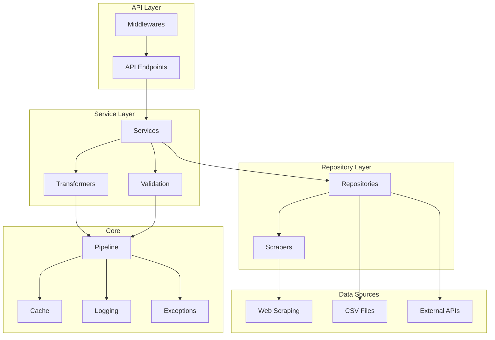
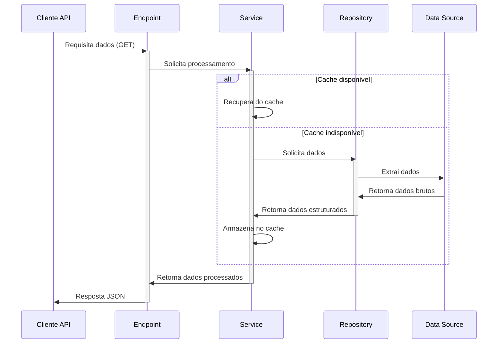
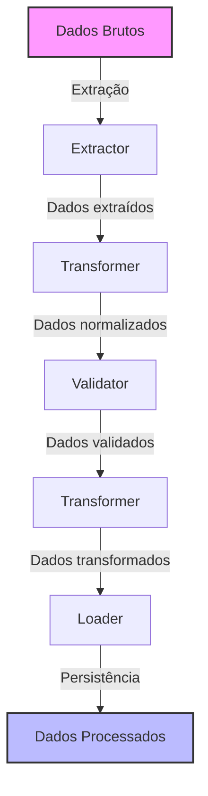
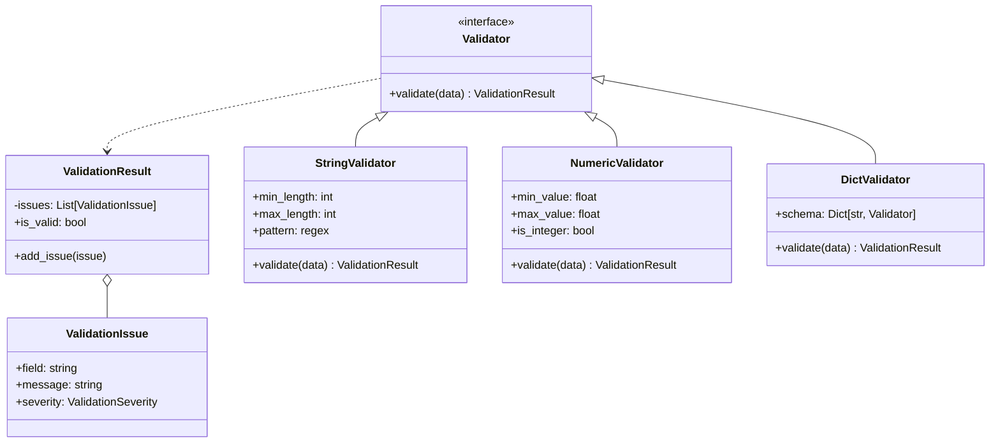
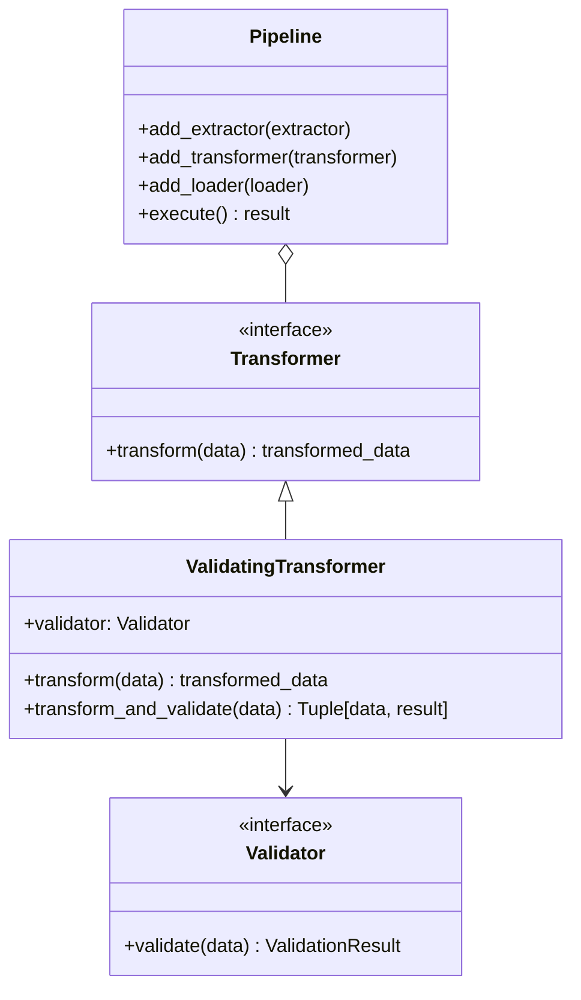

# VitiBrasil API - Arquitetura do Sistema

Este documento descreve a arquitetura geral do sistema VitiBrasil API, apresentando seus componentes principais, fluxos de dados e interações entre módulos.

## 1. Visão Geral da Arquitetura

O VitiBrasil API é uma aplicação baseada em FastAPI que fornece dados estruturados sobre a indústria vitivinícola brasileira. A arquitetura do sistema é organizada em camadas, seguindo padrões de Clean Architecture e princípios SOLID.

## 2. Componentes Principais

### 2.1. API Layer
- **Endpoints**: Interfaces REST para acesso aos dados
- **Middlewares**: Componentes para processamento de requisições (cache, logs, autenticação)

### 2.2. Service Layer
- **Services**: Lógica de negócio e orquestração de dados
- **Transformers**: Conversão e normalização de dados
- **Validation**: Validação de dados de entrada e saída

### 2.3. Repository Layer
- **Repositories**: Acesso a dados de diferentes fontes
- **Scrapers**: Extração de dados de sites específicos

### 2.4. Core
- **Pipeline**: Framework para processamento ETL de dados
- **Cache**: Sistema de cache para otimizar desempenho
- **Logging**: Sistema de logging para monitoramento
- **Exceptions**: Tratamento padronizado de exceções

### 2.5. Data Sources
- **Web Scraping**: Extração de dados de sites governamentais
- **CSV Files**: Arquivos locais para fallback e dados históricos
- **External APIs**: Integração com APIs externas

## 3. Fluxos de Dados Principais

### 3.1. Fluxo de Requisição API

### 3.2. Fluxo de Processamento ETL

## 4. Sistema de Validação

O sistema de validação é um componente crítico que garante a integridade dos dados processados:

## 5. Integração Pipeline e Validação

## 6. Tecnologias Utilizadas

- **Framework Web**: FastAPI
- **Scraping**: BeautifulSoup, Requests
- **Processamento de Dados**: Pandas
- **Validação**: Sistema customizado de validação
- **Documentação**: OpenAPI (Swagger)
- **Logging**: Loggers com formatação JSON
- **Cache**: Sistema In-memory e baseado em arquivos
