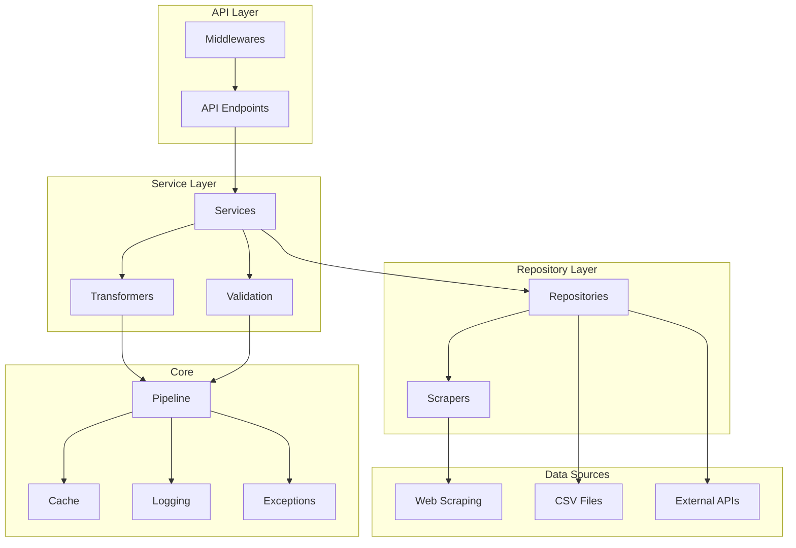
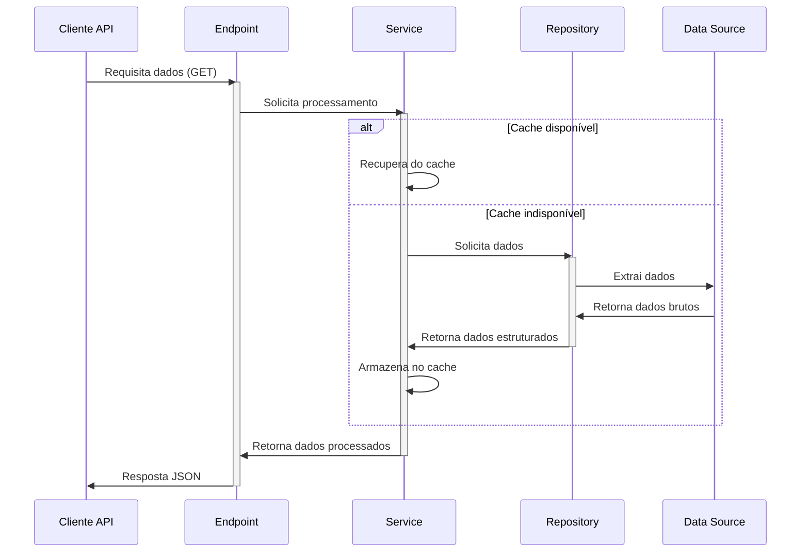
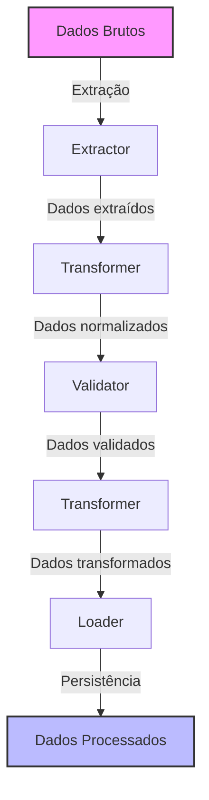
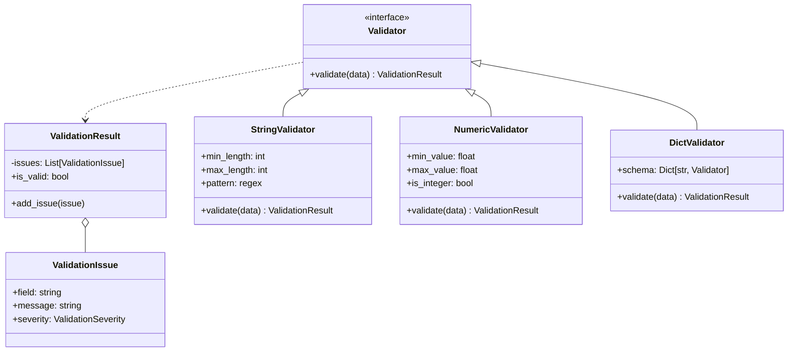
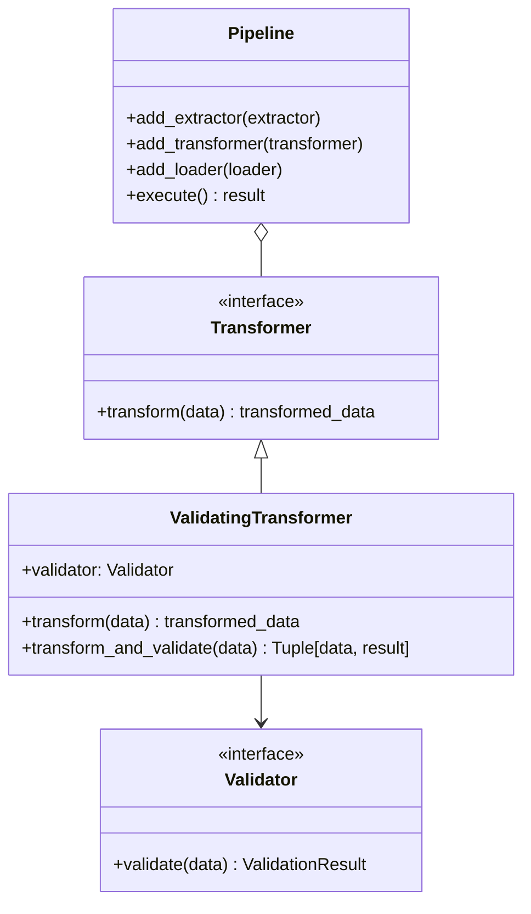
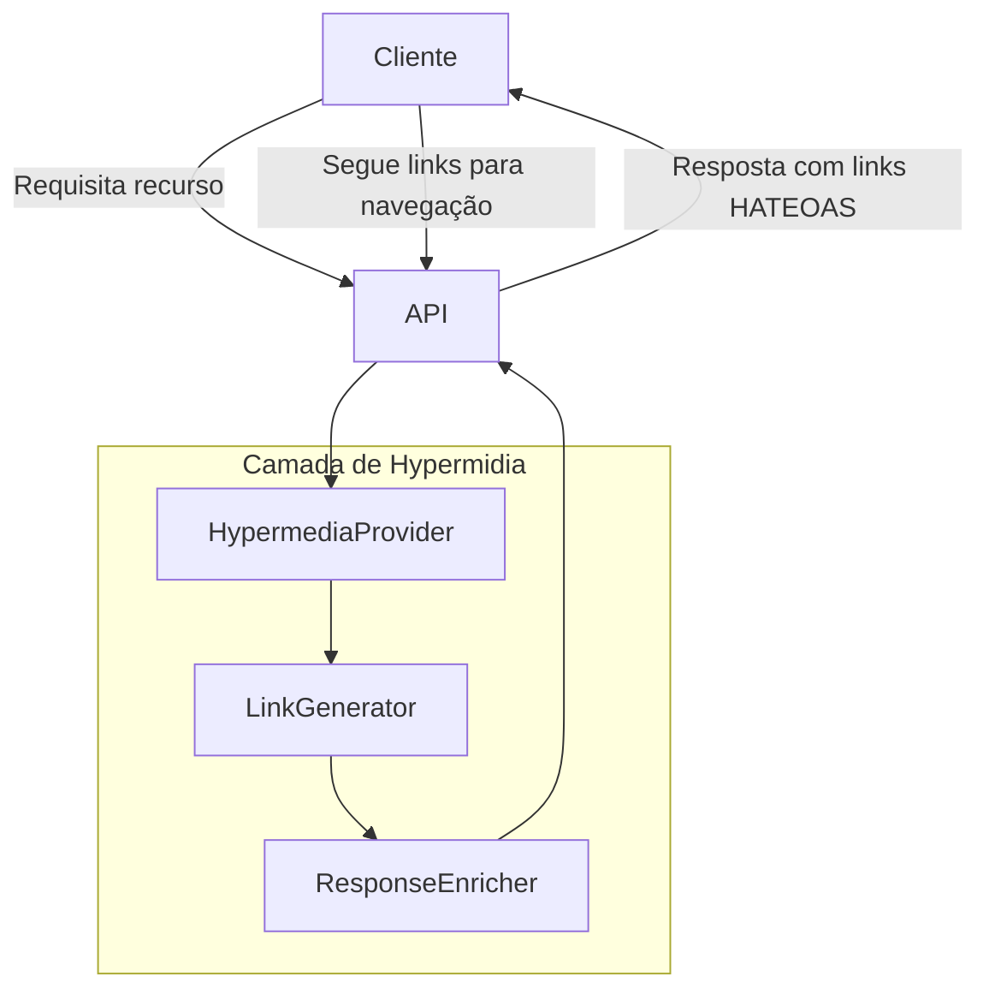

# VitiBrasil API - Arquitetura do Sistema

Este documento descreve a arquitetura geral do sistema VitiBrasil API, apresentando seus componentes principais, fluxos de dados e interações entre módulos.

## 1. Visão Geral da Arquitetura

O VitiBrasil API é uma aplicação baseada em FastAPI que fornece dados estruturados sobre a indústria vitivinícola brasileira. A arquitetura do sistema é organizada em camadas, seguindo padrões de Clean Architecture e princípios SOLID.

### Diagrama de Arquitetura

<!-- 
DIAGRAMA DE ARQUITETURA - IMAGEM SERÁ INSERIDA MANUALMENTE 
Recomendação: Inserir aqui a imagem do diagrama de arquitetura completo.
Nome sugerido do arquivo: architecture_diagram.png
Tamanho recomendado: 800-1200px de largura
-->


### Estrutura de Camadas



## 2. Componentes Principais

### 2.1. API Layer
- **Endpoints**: Interfaces REST para acesso aos dados
- **Middlewares**: Componentes para processamento de requisições (cache, logs, autenticação)

### 2.2. Service Layer
- **Services**: Lógica de negócio e orquestração de dados
- **Transformers**: Conversão e normalização de dados
- **Validation**: Validação de dados de entrada e saída

### 2.3. Repository Layer
- **Repositories**: Acesso a dados de diferentes fontes
- **Scrapers**: Extração de dados de sites específicos

### 2.4. Core
- **Pipeline**: Framework para processamento ETL de dados
- **Cache**: Sistema de cache para otimizar desempenho
- **Logging**: Sistema de logging para monitoramento
- **Exceptions**: Tratamento padronizado de exceções

### 2.5. Data Sources
- **Web Scraping**: Extração de dados de sites governamentais
- **CSV Files**: Arquivos locais para fallback e dados históricos
- **External APIs**: Integração com APIs externas

## 3. Fluxos de Dados Principais

### 3.1. Fluxo de Requisição API



### 3.2. Fluxo de Processamento ETL



## 4. Sistema de Validação

O sistema de validação é um componente crítico que garante a integridade dos dados processados:



## 5. Integração Pipeline e Validação



## 6. Tecnologias Utilizadas

- **Framework Web**: FastAPI
- **Scraping**: BeautifulSoup, Requests
- **Processamento de Dados**: Pandas
- **Validação**: Sistema customizado de validação
- **Documentação**: OpenAPI (Swagger)
- **Logging**: Loggers com formatação JSON
- **Cache**: Sistema In-memory e baseado em arquivos

## 7. Melhorias Recentes de Código

### 7.1. Sistema de Validação Tipo-Seguro

O sistema de validação foi aprimorado para garantir maior segurança de tipos:

- **Verificações explícitas para valores nulos** antes de operações de comparação
- **Tratamento especializado para valores NaN** em validações numéricas
- **Compatibilidade total** com ferramentas de análise estática de código (Pylance, mypy)
- **Mensagens de erro mais descritivas** sobre problemas de tipo encontrados

```python
# Exemplo de validação tipo-segura em NumericValidator
def validate(self, data: Optional[Union[int, float]]) -> ValidationResult:
    result, should_continue = validate_common(data, self.field_name, self.required)
    if not should_continue:
        return result
    
    # Verificação explícita para garantir tipo-segurança
    if data is None:
        return result
        
    # Agora é seguro usar operadores de comparação
    if self.min_value is not None and data < self.min_value:
        result.add_issue(...)
```

### 7.2. Robustez do Sistema de Cache

O sistema de cache foi reforçado para maior resiliência:

- **Tratamento de exceções aprimorado** em todas as operações de cache
- **Verificações explícitas de valores nulos** para medições de tempo de execução
- **Fallback automático** para execução direta quando o cache falha
- **Compatibilidade com análise estática de tipos**

```python
# Exemplo de tratamento robusto no sistema de cache
if measure_time:
    start_time = time.time()
    
result = await func(*args, **kwargs)

if measure_time:
    # Garantindo que start_time está definido antes de usar
    execution_time = time.time() - start_time  # type: ignore
    if log_timing:
        logger.info(f"Function {func.__name__} executed in {execution_time:.4f}s")
```

Essas melhorias aumentam significativamente a confiabilidade do sistema, especialmente em ambientes de produção com altas demandas de uso.

## 8. Implementação de HATEOAS

A arquitetura foi aprimorada para incluir suporte completo ao princípio HATEOAS (Hypermedia as the Engine of Application State), um componente essencial para APIs verdadeiramente RESTful:



### 8.1 Componentes HATEOAS

- **ResponseEnricher**: Middleware que adiciona links _HAL a todas as respostas
- **LinkGenerator**: Gera links apropriados com base no tipo de recurso
- **RelationshipManager**: Gerencia relações entre diferentes recursos

### 8.2 Benefícios Arquiteturais

- **Desacoplamento total**: Clientes não precisam conhecer URLs específicas além da raiz da API
- **Evolução flexível**: Endpoints podem ser reorganizados sem quebrar clientes existentes
- **Descoberta automática**: Clientes podem navegar pela API como se fosse uma interface baseada em hipertexto
- **Autodescrição**: A API descreve suas próprias capacidades e relações

### 8.3 Implementação

```python
def add_links(response: Dict[str, Any], resource_path: str, year: Optional[int] = None) -> Dict[str, Any]:
    """
    Adiciona links HATEOAS a uma resposta.
    """
    base_path = f"/api/v1/{resource_path}"
    
    # Links básicos
    links: Dict[str, Any] = {
        "self": {"href": base_path}
    }
    
    # Links específicos por tipo de recurso
    if resource_path == "production":
        links["wine"] = {"href": f"{base_path}/wine"}
        # ...outros links específicos...
    
    # Add related resource links
    links["related"] = {
        "production": {"href": "/api/v1/production"},
        "imports": {"href": "/api/v1/imports"},
        # ...outros recursos relacionados...
    }
    
    # Adicionar parâmetro de ano se fornecido
    if year is not None:
        # ...lógica para adicionar ano aos links...
        
    # Adicionar os links à resposta
    response["_links"] = links
    return response
```
