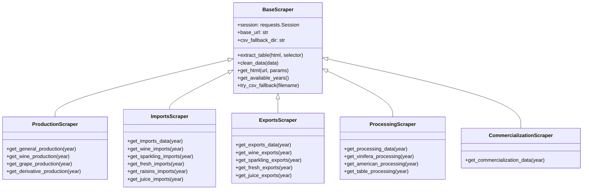

# Sistema de Scraping da ViticultureAPI

Este documento detalha o sistema de scraping da ViticultureAPI, explicando sua arquitetura, componentes e funcionalidades.

## 1. Visão Geral

O sistema de scraping é responsável pela extração de dados do site VitiBrasil da Embrapa. Sua arquitetura é baseada em uma classe-base abstrata que define a interface e comportamentos comuns, e classes especializadas para cada tipo de dado (produção, importações, exportações, etc.).



## 2. BaseScraper (`app/scraper/base_scraper.py`)

A classe `BaseScraper` fornece a infraestrutura fundamental para todas as operações de scraping, incluindo:

1. **Configuração da sessão HTTP** com retry automático
2. **Extração de tabelas** de HTML
3. **Limpeza e normalização** de dados
4. **Fallback para CSV** quando o scraping falha
5. **Detecção de anos disponíveis**

```python
class BaseScraper:
    """
    Classe base para scrapers do site VitiBrasil.
    
    Fornece métodos comuns para extração e processamento de dados.
    """
    
    def __init__(self, base_url=None, csv_fallback_dir=None):
        """
        Inicializa o scraper com configurações padrão.
        
        Args:
            base_url: URL base do site (opcional)
            csv_fallback_dir: Diretório para arquivos CSV de fallback (opcional)
        """
        # Configurar URL base
        self.base_url = base_url or "http://vitibrasil.cnpuv.embrapa.br/index.php"
        
        # Configurar diretório de fallback
        self.csv_fallback_dir = csv_fallback_dir or os.path.join(
            os.path.dirname(os.path.dirname(os.path.dirname(os.path.abspath(__file__)))),
            "data"
        )
        
        # Configurar sessão HTTP com retry
        self.session = requests.Session()
        retry_strategy = Retry(
            total=3,
            backoff_factor=0.5,
            status_forcelist=[429, 500, 502, 503, 504],
            method_whitelist=["GET"]
        )
        adapter = HTTPAdapter(max_retries=retry_strategy)
        self.session.mount("http://", adapter)
        self.session.mount("https://", adapter)
```

### 2.1. Extração de Tabelas

O método `extract_table` é responsável por extrair e processar tabelas HTML, lidando com diferentes estruturas e formatos:

```python
def extract_table(self, html_content, table_selector="table", header_selector="th"):
    """
    Extrai uma tabela de conteúdo HTML usando BeautifulSoup.
    
    Args:
        html_content: Conteúdo HTML da página
        table_selector: Seletor CSS para encontrar a tabela
        header_selector: Seletor CSS para encontrar cabeçalhos na tabela
        
    Returns:
        Dicionário com dados extraídos, URL fonte e metadados
    """
    try:
        soup = BeautifulSoup(html_content, "html.parser")
        
        # Encontrar todas as tabelas na página
        tables = soup.select(table_selector)
        logger.info(f"Found {len(tables)} tables in the page")
        
        if not tables:
            logger.warning("Tabela não encontrada na página")
            return {"data": [], "source": "web_scraping_failed", "error": "Tabela não encontrada"}

        # Estratégia para múltiplas tabelas: escolher a mais provável
        if len(tables) > 1:
            # Sistema de pontuação para escolher a tabela mais provável
            best_table = None
            best_score = -1
            
            for i, table in enumerate(tables):
                score = 0
                
                # Tabelas maiores têm prioridade
                rows = table.find_all('tr')
                score += len(rows) * 2
                
                # Tabelas com cabeçalhos têm prioridade
                headers = table.select(header_selector)
                score += len(headers) * 3
                
                # Tabelas com conteúdo numérico têm prioridade
                numeric_cells = sum(1 for cell in table.find_all(['td', 'th']) 
                                if cell.text.strip() and any(c.isdigit() for c in cell.text))
                score += numeric_cells
                
                # Verificar texto para ignorar tabelas irrelevantes
                table_text = table.get_text().lower()
                preview = table_text[:50].replace('\n', ' ')
                
                # Se for claramente uma tabela de navegação ou irrelevante, ignorar
                if len(table_text) < 20 or "«" in table_text[:10]:
                    logger.info(f"Skipping likely non-data table: {preview}...")
                    continue
                    
                if score > best_score:
                    best_score = score
                    best_table = table
            
            if best_table:
                table = best_table
            else:
                table = tables[0]  # Fallback para a primeira tabela
        else:
            table = tables[0]
```

### 2.2. Sistema de Fallback para CSV

O método `try_csv_fallback` implementa um mecanismo de recuperação quando o scraping web falha:

```python
def try_csv_fallback(self, filename, year=None):
    """
    Tenta carregar dados de um arquivo CSV de fallback quando o scraping web falha.
    
    Args:
        filename: Nome do arquivo CSV sem extensão
        year: Ano específico para filtrar (opcional)
        
    Returns:
        Dicionário com dados do CSV ou mensagem de erro
    """
    try:
        # Construir o caminho completo para o arquivo CSV
        csv_path = os.path.join(self.csv_fallback_dir, f"{filename}.csv")
        
        if not os.path.exists(csv_path):
            logger.warning(f"CSV fallback file not found: {csv_path}")
            return {"data": [], "source": "csv_fallback_failed", "error": "Arquivo CSV não encontrado"}
        
        # Carregar o CSV com pandas
        df = pd.read_csv(csv_path)
        
        # Filtrar por ano se necessário
        if year is not None and "Ano" in df.columns:
            df = df[df["Ano"] == year]
        
        # Converter para lista de dicionários
        data = df.to_dict(orient="records")
        
        logger.info(f"Successfully loaded data from CSV fallback: {len(data)} records")
        return {
            "data": data,
            "source": "csv_fallback",
            "source_file": csv_path
        }
    except Exception as e:
        logger.error(f"Error using CSV fallback: {str(e)}")
        return {"data": [], "source": "csv_fallback_failed", "error": str(e)}
```

### 2.3. Limpeza de Dados

O sistema implementa funções robustas para limpeza de dados, tratando inconsistências comuns:

```python
def clean_data(self, data):
    """
    Limpa e normaliza dados extraídos.
    
    Args:
        data: Lista de dicionários com dados extraídos
        
    Returns:
        Dados limpos e normalizados
    """
    if not data:
        return []
        
    cleaned_data = []
    
    for item in data:
        # Criar um novo item limpo
        clean_item = {}
        
        for key, value in item.items():
            # Remover espaços extras
            if isinstance(value, str):
                value = value.strip()
                
                # Converter strings vazias para None
                if value == "":
                    value = None
                    
                # Normalizar valores numéricos
                elif value and all(c.isdigit() or c in ".,- " for c in value):
                    try:
                        # Lidar com separadores de milhares e decimais
                        value = value.replace(".", "").replace(",", ".")
                        value = float(value)
                        # Converter para int se for um número inteiro
                        if value.is_integer():
                            value = int(value)
                    except (ValueError, AttributeError):
                        pass
                        
            # Armazenar o valor limpo
            clean_item[key] = value
            
        cleaned_data.append(clean_item)
        
    logger.info(f"After cleaning: {len(cleaned_data)} rows of data")
    return cleaned_data
```

## 3. Scrapers Especializados

### 3.1. ProductionScraper (`app/scraper/production_scraper.py`)

O `ProductionScraper` é especializado na extração de dados de produção vitivinícola:

```python
class ProductionScraper(BaseScraper):
    """
    Scraper específico para dados de produção de vinhos, uvas e derivados.
    """
    
    def get_general_production(self, year=None):
        """
        Obtém dados gerais de produção.
        
        Args:
            year: Ano específico (opcional)
            
        Returns:
            Dicionário com dados de produção
        """
        params = {
            "opcao": "opt_02",
            "subopcao": "subopt_00"
        }
        
        if year is not None:
            params["ano"] = year
        
        try:
            logger.info(f"Making request to {self.base_url} with params {params}")
            html = self.get_html(self.base_url, params)
            
            if not html:
                # Tenta fallback para CSV
                return self.try_csv_fallback("production_general", year)
                
            # Extrair tabela
            result = self.extract_table(html)
            
            # Adicionar origem e URL
            result["source"] = "web_scraping"
            result["source_url"] = self.base_url + "?" + urlencode(params)
            
            return result
            
        except Exception as e:
            logger.error(f"Error scraping general production data: {str(e)}")
            # Tenta fallback para CSV
            return self.try_csv_fallback("production_general", year)
```

### 3.2. ImportsScraper (`app/scraper/imports_scraper.py`)

O `ImportsScraper` extrai dados de importação com múltiplas estratégias:

```python
class ImportsScraper(BaseScraper):
    """
    Scraper específico para dados de importação.
    """
    
    def get_imports_data(self, year=None):
        """
        Obtém dados combinados de importação.
        
        Para importações, a opção 'subopt_00' nem sempre retorna dados
        consolidados corretos. Esta função combina dados de todos os
        subtipos para construir uma visão completa.
        
        Args:
            year: Ano específico (opcional)
            
        Returns:
            Dicionário com dados combinados de importação
        """
        # Primeiro, tenta obter dados do CSV consolidado
        csv_result = self.try_csv_fallback("imports_combined", year)
        
        if csv_result.get("data") and len(csv_result.get("data", [])) > 0:
            return csv_result
        
        # Se não houver CSV, combina dados dos endpoints específicos
        combined_data = []
        
        # Lista de métodos para obter diferentes tipos de importação
        import_methods = [
            self.get_wine_imports,
            self.get_sparkling_imports,
            self.get_fresh_imports,
            self.get_raisins_imports,
            self.get_juice_imports
        ]
        
        for method in import_methods:
            try:
                result = method(year)
                if result.get("data") and len(result.get("data", [])) > 0:
                    # Adicionar tipo de importação aos registros
                    method_name = method.__name__.replace("get_", "").replace("_imports", "")
                    for item in result["data"]:
                        item["tipo_importacao"] = method_name
                    
                    combined_data.extend(result["data"])
            except Exception as e:
                logger.warning(f"Error combining data from {method.__name__}: {str(e)}")
        
        return {
            "data": combined_data,
            "source": "combined_endpoints",
            "source_url": self.base_url
        }
```

### 3.3. ExportsScraper (`app/scraper/exports_scraper.py`)

O `ExportsScraper` segue um padrão similar ao ImportsScraper:

```python
class ExportsScraper(BaseScraper):
    """
    Scraper específico para dados de exportação.
    """
    
    def get_wine_exports(self, year=None):
        """
        Obtém dados de exportação de vinhos.
        
        Args:
            year: Ano específico (opcional)
            
        Returns:
            Dicionário com dados de exportação de vinhos
        """
        params = {
            "opcao": "opt_04",
            "subopcao": "subopt_01"
        }
        
        if year is not None:
            params["ano"] = year
            
        try:
            html = self.get_html(self.base_url, params)
            
            if not html:
                # Tenta fallback para CSV
                return self.try_csv_fallback("exports_wine", year)
                
            # Extrair tabela
            result = self.extract_table(html)
            
            # Adicionar origem e URL
            result["source"] = "web_scraping"
            result["source_url"] = self.base_url + "?" + urlencode(params)
            
            return result
            
        except Exception as e:
            logger.error(f"Error scraping wine export data: {str(e)}")
            # Tenta fallback para CSV
            return self.try_csv_fallback("exports_wine", year)
```

## 4. Tratamento de Problemas Comuns

### 4.1. Limpeza de Setas de Navegação

Um problema recorrente nos dados são as setas de navegação (`«‹›»`) que aparecem em tabelas:

```python
def clean_navigation_arrows(data_list):
    """
    Remove navigation arrow entries from scraped data results and fix data structure.
    
    This function:
    1. Removes navigation arrow entries ("«‹›»")
    2. Fixes duplicate quantity fields by keeping only "Quantidade (L.)" when both are present
    3. Cleans navigation arrows from quantity values before they cause conversion errors
    """
    if not data_list or not isinstance(data_list, list):
        return data_list
    
    cleaned_data = []
    removed_count = 0
    fixed_fields_count = 0
    cleaned_values_count = 0
    
    # Regular expression to detect navigation arrows
    nav_arrows_pattern = re.compile(r'[«‹›»]')
    
    for item in data_list:
        # Skip items that match the navigation arrows pattern
        if (isinstance(item, dict) and 
            item.get("Produto", "") == "" and 
            "«‹›»" in str(item.get("Quantidade (L.)", ""))):
            removed_count += 1
            continue
        
        # Skip items with navigation arrows in any quantity field
        if isinstance(item, dict) and any("«‹›»" in str(value) for value in item.values()):
            removed_count += 1
            continue
        
        # Clean up any fields that might contain navigation arrows but weren't caught by the filters above
        if isinstance(item, dict):
            for key in item:
                if isinstance(item[key], str) and nav_arrows_pattern.search(item[key]):
                    # Replace navigation arrows with empty string for any field that might contain them
                    item[key] = nav_arrows_pattern.sub('', item[key]).strip()
                    cleaned_values_count += 1
                    
                    # If after cleaning the field is empty, set to None or 0 based on expected type
                    if item[key] == '':
                        if key.startswith('Quantidade') or key in ('Valor', 'Ano'):
                            item[key] = 0
                        else:
                            item[key] = None
        
        # Fix duplicate quantity fields - remove "Quantidade" if "Quantidade (L.)" exists
        if isinstance(item, dict) and "Quantidade (L.)" in item and "Quantidade" in item:
            # We're keeping "Quantidade (L.)" and removing "Quantidade"
            item.pop("Quantidade", None)
            fixed_fields_count += 1
            
        cleaned_data.append(item)
    
    if removed_count > 0:
        logger.info(f"Removed {removed_count} navigation arrow entries from data")
        
    if fixed_fields_count > 0:
        logger.info(f"Fixed {fixed_fields_count} items with duplicate quantity fields")
        
    if cleaned_values_count > 0:
        logger.info(f"Cleaned navigation arrows from {cleaned_values_count} field values")
        
    return cleaned_data
```

### 4.2. Conversão Segura de Valores Numéricos

Para lidar com inconsistências na formatação de números:

```python
def safe_float_conversion(value, default=0.0):
    """
    Safely convert a value to float, handling navigation arrows and other invalid formats.
    Returns the default value if conversion fails.
    """
    if value is None:
        return default
        
    if isinstance(value, (int, float)):
        return float(value)
        
    if isinstance(value, str):
        # Remove navigation arrows and any non-numeric characters except decimal separator
        cleaned_value = re.sub(r'[^0-9\.,]', '', value.replace('«‹›»', ''))
        
        # Handle different decimal separators
        cleaned_value = cleaned_value.replace(',', '.')
        
        # If we have a valid string after cleaning, try to convert it
        if cleaned_value:
            try:
                return float(cleaned_value)
            except ValueError:
                logger.debug(f"Could not convert '{value}' to float even after cleaning")
        
    logger.warning(f"Could not convert '{value}' to float, using default {default}")
    return default
```

## 5. Integração com Cache

Os scrapers são integrados ao sistema de cache para evitar requisições desnecessárias:

```python
# Exemplo de uso com cache em endpoints/production.py
@router.get("/wine", summary="Dados de produção de vinho")
@cache_result(ttl_seconds=3600)  # Cache por 1 hora
async def get_wine_production(
    year: Optional[int] = Query(None, description="Filtrar por ano específico"),
    current_user: str = Depends(verify_token)
):
    """
    Retorna dados sobre produção de vinhos, com possibilidade de filtrar por ano.
    """
    try:
        logger.info(f"Fetching wine production data for year: {year}")
        
        scraper = ProductionScraper()
        result = scraper.get_wine_production(year)
        
        # Clean the data
        if "data" in result and isinstance(result["data"], list):
            result["data"] = clean_navigation_arrows(result["data"])
        
        # Check for empty data
        if not result.get("data") or len(result.get("data", [])) == 0:
            logger.warning(f"Empty data returned for year {year}")
            return {
                "data": [],
                "total": 0,
                "ano_filtro": year,
                "message": "Não foram encontrados dados para o ano especificado"
            }
        
        # Add year to response if filtered
        if year:
            result["ano_filtro"] = year
        
        return result
        
    except Exception as e:
        logger.error(f"Error fetching wine production data: {str(e)}")
        raise HTTPException(
            status_code=500, 
            detail=f"Erro ao obter dados de produção de vinhos: {str(e)}"
        )
```

## 6. Características de Robustez

O sistema de scraping é projetado com múltiplas camadas de robustez:

1. **Retry automático** para falhas temporárias de rede
2. **Sistema de fallback para CSV** quando o scraping web falha
3. **Estratégias múltiplas de extração de tabelas** para lidar com estruturas de HTML inconsistentes
4. **Seleção inteligente de tabelas** usando sistema de pontuação
5. **Limpeza detalhada dos dados** para remover artefatos de scraping
6. **Logging extensivo** para diagnóstico e monitoramento
7. **Tratamento de valores atípicos** e inconsistências nos dados de origem

Essas características garantem que a API continue funcionando mesmo quando há mudanças na estrutura do site de origem ou problemas temporários de conectividade.
