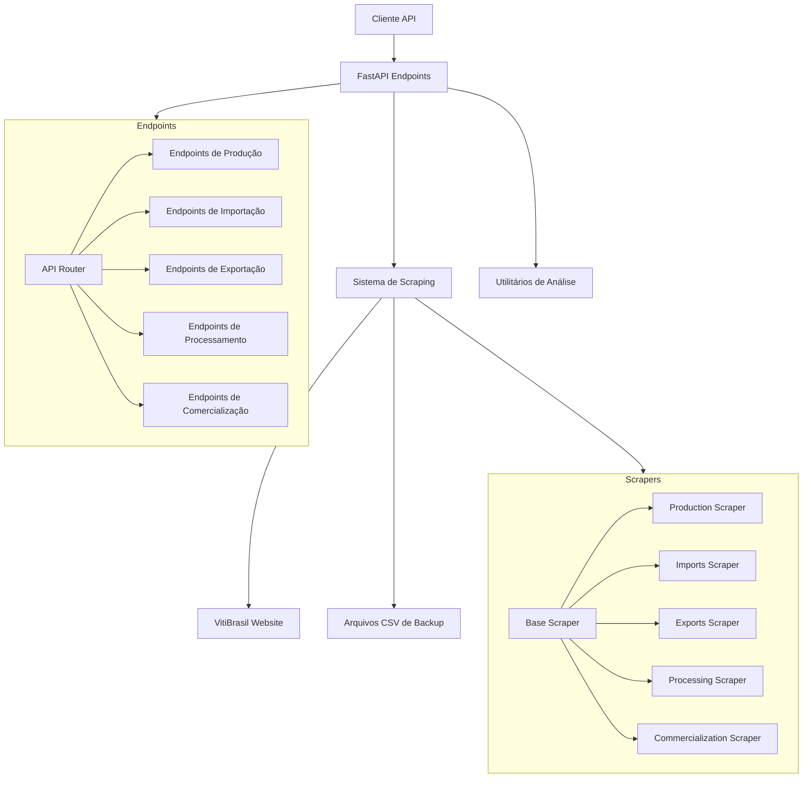
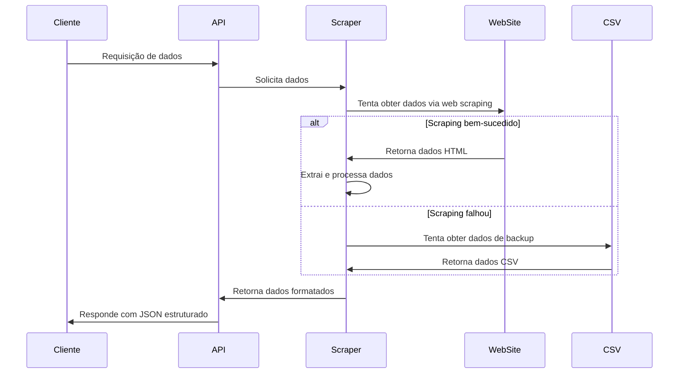

# VitiBrasil API - Documentação Técnica

## 1. Visão Geral

A VitiBrasil API é um projeto desenvolvido para facilitar o acesso programático aos dados de vitivinicultura fornecidos pela Embrapa. O sistema atua como uma camada intermediária que extrai, processa e disponibiliza dados através de endpoints RESTful, permitindo que pesquisadores, empresas e desenvolvedores possam consumir informações sobre produção, processamento, comercialização, importação e exportação de produtos vitivinícolas brasileiros.

## 2. Arquitetura do Sistema

O projeto segue uma arquitetura modular baseada em FastAPI, com componentes especializados para scraping, processamento de dados e disponibilização via API.



### Fluxo de Dados



## 3. Requisitos Técnicos

### 3.1 Dependências

```
# API Framework
fastapi>=0.95.0
uvicorn>=0.21.1

# Data processing
pandas>=1.5.3
numpy>=1.24.2

# Web scraping
requests>=2.28.2
beautifulsoup4>=4.12.0

# Configuration
python-dotenv>=1.0.0
```

### 3.2 Estrutura de Diretórios

```
viticultureapi/
│
├── app/
│   ├── api/
│   │   ├── endpoints/
│   │   │   ├── auth.py
│   │   │   ├── commercialization.py
│   │   │   ├── exports.py
│   │   │   ├── imports.py
│   │   │   ├── processing.py
│   │   │   └── production.py
│   │   ├── api.py
│   │   └── __init__.py
│   │
│   ├── core/
│   │   ├── config.py
│   │   ├── security.py
│   │   └── __init__.py
│   │
│   ├── schemas/
│   │   ├── production.py
│   │   └── __init__.py
│   │
│   ├── scraper/
│   │   ├── base_scraper.py
│   │   ├── commercialization_scraper.py
│   │   ├── exports_scraper.py
│   │   ├── imports_scraper.py
│   │   ├── processing_scraper.py
│   │   ├── production_scraper.py
│   │   └── __init__.py
│   │
│   ├── utils/
│   │   └── data_analysis.py
│   │
│   ├── tests/
│   │   └── test_scraper.py
│   │
│   ├── main.py
│   └── __init__.py
│
├── data/            # Diretório para arquivos CSV de backup
├── .env             # Variáveis de ambiente
├── requirements.txt # Dependências do projeto
└── README.md        # Documentação básica
```

## 4. Componentes Principais

### 4.1 BaseScraper

A classe `BaseScraper` serve como fundação para todos os scrapers específicos, fornecendo funcionalidades comuns:

- Configuração de sessão HTTP com retry
- Extração de tabelas HTML
- Identificação de anos disponíveis
- Fallback para arquivos CSV locais quando o scraping falha
- Limpeza e formatação de dados numéricos

### 4.2 Scrapers Especializados

- **ProductionScraper**: Extrai dados de produção vitivinícola
- **ImportsScraper**: Extrai dados de importação
- **ExportsScraper**: Extrai dados de exportação
- **ProcessingScraper**: Extrai dados de processamento
- **CommercializationScraper**: Extrai dados de comercialização interna

### 4.3 API Endpoints

Os endpoints da API são organizados em routers específicos para cada categoria de dados:

- `/api/v1/production/`: Dados de produção
- `/api/v1/imports/`: Dados de importação
- `/api/v1/exports/`: Dados de exportação
- `/api/v1/processing/`: Dados de processamento
- `/api/v1/commercialization/`: Dados de comercialização

Todos os endpoints aceitam filtros por ano e retornam respostas padronizadas em formato JSON.

## 5. Desafios e Soluções

### 5.1 Inconsistência nos Dados de Origem

**Desafio**: O site VitiBrasil apresenta inconsistências na estrutura HTML, formatação de tabelas e disponibilidade de dados para diferentes anos.

**Solução**: 
- Implementação de múltiplas estratégias de extração de tabelas
- Sistema de pontuação para selecionar a melhor tabela em cada página
- Validação robusta dos dados extraídos
- Normalização de cabeçalhos e valores numéricos

### 5.2 Falhas no Web Scraping

**Desafio**: O scraping frequentemente falha devido a alterações no site, tempos limite ou problemas na estrutura da página.

**Solução**:
- Sistema de fallback para arquivos CSV locais
- Mecanismo de retry com backoff exponencial
- Logging detalhado para diagnóstico
- Manipulação de exceções em múltiplos níveis

### 5.3 Coleta de Dados para Múltiplos Anos

**Desafio**: Obter dados históricos para todos os anos disponíveis requer múltiplas requisições e pode ser lento.

**Solução**:
- Detecção automática de anos disponíveis
- Estratégia de coleta eficiente para múltiplos anos
- Cache de resultados em arquivos CSV locais

### 5.4 Problema com Dados de Importação

**Desafio**: A opção 'subopt_00' para importações não retornava dados reais, apenas registros vazios com zeros para todos os anos.

**Solução**:
- Implementação de um método que combina dados de todas as subcategorias quando solicitados dados gerais de importação
- Tentativa primária de uso do CSV de fallback para dados agregados
- Combinação de dados de subendpoints funcionais (vinhos, espumantes, uvas frescas, passas, sucos)
- Rastreamento apropriado de fontes para atribuição de origem dos dados

## 6. Como Usar a API

### 6.1 Executando Localmente

```
# Clonar o repositório
git clone https://github.com/argusportal/viticultureapi.git
cd viticultureapi

# Instalar dependências
pip install -r requirements.txt

# Executar o servidor
uvicorn app.main:app --reload
```

### 6.2 Exemplos de Requisições

#### Produção de Vinhos para um Ano Específico
```
GET /api/v1/production/wine?year=2022
```

#### Todos os Dados de Importação
```
GET /api/v1/imports/
```

#### Exportação de Sucos
```
GET /api/v1/exports/juice
```

### 6.3 Formato de Resposta

```json
{
  "data": [
    {
      "Produto": "Vinho Tinto",
      "Quantidade": "156.789.431",
      "Ano": 2022
    },
    // ... outros registros
  ],
  "total": 25,
  "ano_filtro": 2022,
  "source_url": "http://vitibrasil.cnpuv.embrapa.br/index.php?opcao=opt_02&subopcao=subopt_01",
  "source": "web_scraping"
}
```

## 7. Análise de Dados

A classe `WineDataAnalyzer` fornece utilitários para análise dos dados obtidos:

- Limpeza e preparação de dados
- Cálculo de totais por categoria
- Comparação entre anos
- Identificação de produtos principais
- Comparação entre diferentes endpoints
- Geração de relatórios de análise

## 8. Conclusão

A VitiBrasil API resolve o problema de acesso programático aos dados de vitivinicultura brasileira, superando desafios de scraping e inconsistências nos dados de origem. A arquitetura modular e os mecanismos de fallback garantem alta disponibilidade e confiabilidade dos dados, mesmo quando há problemas no site de origem.

O projeto continua em desenvolvimento, com planos para:
- Ampliar a cobertura de tipos de dados
- Implementar caches para melhorar a performance
- Adicionar visualizações integradas
- Desenvolver um painel de administração

## 9. Atualizações Recentes

### 9.1 Melhorias na Documentação Interativa

- Substituição da interface Swagger UI personalizada (/custom-docs) pela interface padrão do FastAPI (/docs)
- Correção de problemas de codificação UTF-8 em templates customizados
- Otimização da renderização de Markdown na documentação da API
- Simplificação da estrutura de arquivos estáticos

### 9.2 Modelo de Autenticação

A API adota um modelo de acesso aberto para promover o uso acadêmico e a democratização dos dados:

- **Endpoints públicos**: Todos os endpoints de consulta de dados são públicos, sem necessidade de autenticação
- **Infraestrutura de autenticação**: Sistema de autenticação OAuth2 implementado para uso futuro
- **Controle de acesso**: Preparado para restringir operações administrativas ou de modificação quando necessário

### 9.3 Outras Melhorias

- Padronização do formato OpenAPI para versão 3.0.0
- Tratamento de exceções melhorado com logging detalhado
- Endpoint de diagnóstico (/debug/openapi) para verificação do schema OpenAPI
- Configurações personalizadas de Swagger UI para melhor experiência do usuário

## 10. Referências

- [Embrapa VitiBrasil](http://vitibrasil.cnpuv.embrapa.br/)
- [FastAPI Documentation](https://fastapi.tiangolo.com/)
- [Beautiful Soup Documentation](https://www.crummy.com/software/BeautifulSoup/bs4/doc/)
- [Swagger UI Documentation](https://swagger.io/tools/swagger-ui/)
- https://excalidraw.com/#json=x1k7UaBZE6iPtxbXyFfkA,QZc81REYTBitIVDsFZ84XQ

## 11. Otimizações de Performance

### 11.1 Sistema de Cache

A API implementa múltiplas camadas de cache para melhorar o desempenho:

1. **Cache de Resultados In-Memory**: 
   - Resultados de operações custosas (como web scraping) são cacheados em memória
   - TTL (Time-To-Live) configurável por endpoint
   - Reduz significativamente o tempo de resposta para consultas repetidas

2. **Cache HTTP**:
   - Headers HTTP (Cache-Control, ETag, Expires) implementados automaticamente
   - Permite que browsers e proxies façam cache das respostas
   - Reduz a carga no servidor e melhora a experiência do usuário

3. **Endpoints de Gerenciamento**:
   - `/api/v1/cache/info`: Mostra estatísticas do cache
   - `/api/v1/cache/clear`: Limpa o cache (útil para testes e quando há atualizações de dados)
   - `/api/v1/cache/test`: Demonstra a diferença de performance entre respostas cacheadas e não-cacheadas

### 11.2 Robustez do Sistema de Cache

O sistema de cache foi projetado para alta resiliência, garantindo que falhas no cache nunca comprometam a funcionalidade principal:

1. **Tratamento Robusto de Exceções**:
   - Todas as operações de cache são envolvidas em blocos try/except
   - Falhas no cache apenas ativam o fallback para execução direta da função original
   - Logging detalhado de problemas para diagnóstico

2. **Medição de Performance**:
   - Sistema opcional de medição de tempo de execução
   - Registros de tempo em logs para análise de pontos lentos
   - Adição automática de métricas de tempo em respostas (quando configurado)

3. **Segurança de Tipos**:
   - Verificações explícitas para evitar operações com valores potencialmente nulos
   - Tratamento adequado de casos onde o tempo de início pode não estar definido
   - Compatibilidade com checagem estática de tipos via mypy/pylance

4. **Otimizações de Chaves**:
   - Geração inteligente de chaves de cache baseada em nome de função e parâmetros
   - Limitação automática do tamanho de chaves para evitar problemas com provedores de cache
   - Opção para incluir/excluir certos parâmetros na geração de chaves

A implementação melhora drasticamente o desempenho para dados que não mudam frequentemente, como estatísticas históricas de produção, importação e exportação.

## 12. Implementação HATEOAS (Hypermedia as the Engine of Application State)

A API foi aprimorada para suportar o princípio HATEOAS, elevando-a ao nível 3 de maturidade REST de Richardson:

1. **Links Dinâmicos**:
   - Cada resposta inclui links relacionados sob a chave `_links`
   - Navegação intuitiva entre recursos relacionados
   - Descoberta automática de endpoints disponíveis

2. **Estrutura de Links**:
   - `self`: Link para o próprio recurso
   - Links específicos do recurso (ex: `/production/wine`, `/imports/vinhos`)
   - `related`: Links para outros endpoints principais
   - `prev_year`/`next_year`: Navegação temporal quando aplicável

3. **Benefícios**:
   - **Auto-documentação**: A API se torna auto-explicativa
   - **Desacoplamento**: Clientes não precisam codificar URLs rigidamente
   - **Descoberta**: Facilita a exploração dos endpoints disponíveis
   - **Evolução**: Permite que a API evolua sem quebrar clientes existentes

Exemplo de resposta com HATEOAS:
```json
{
  "data": [...],
  "total": 25,
  "ano_filtro": 2022,
  "_links": {
    "self": {"href": "/api/v1/production"},
    "wine": {"href": "/api/v1/production/wine?year=2022"},
    "grape": {"href": "/api/v1/production/grape?year=2022"},
    "derivative": {"href": "/api/v1/production/derivative?year=2022"},
    "prev_year": {"href": "/api/v1/production?year=2021"},
    "next_year": {"href": "/api/v1/production?year=2023"},
    "related": {
      "imports": {"href": "/api/v1/imports?year=2022"},
      "exports": {"href": "/api/v1/exports?year=2022"},
      "processing": {"href": "/api/v1/processing?year=2022"}
    }
  }
}
```

## 13. Melhorias Adicionais de Sistema

### 13.1 Sistema de Verificação de Dependências

A aplicação agora realiza uma verificação completa das dependências na inicialização:

- Detecta pacotes Python necessários antes de iniciar a aplicação
- Fornece instruções claras para instalação de dependências faltantes
- Previne falhas em runtime causadas por módulos ausentes
- Verifica tanto nomes de módulo quanto seus aliases de importação

### 13.2 Manejo Avançado de Tipos

Todas as partes críticas do sistema foram aprimoradas com:

- Anotações de tipo explícitas usando TypeVar e Generics
- Compatibilidade com verificações estáticas via mypy e pylance
- Validação de tipo em runtime para operações sensíveis a tipo
- Tratamento seguro de valores potencialmente nulos

### 13.3 Testes de Validação Integrados

A suíte de testes foi expandida com:

- Script de validação para confirmar integridade do sistema
- Testes específicos para o sistema de cache
- Verificações do funcionamento do sistema de validação
- Testes de integração entre pipeline e cache

## 14. Estrutura de Models

### 14.1 Visão Geral dos Modelos

A pasta `app/models` contém as definições dos modelos de dados utilizados na API, implementados com Pydantic para garantir validação de dados e tipagem estática. Estes modelos são fundamentais para:

1. **Validação de entrada**: Garantir que dados recebidos pela API estejam no formato esperado
2. **Documentação automática**: Gerar esquemas OpenAPI precisos com base nas definições dos modelos
3. **Serialização/Deserialização**: Converter dados entre formatos JSON e objetos Python
4. **Tipagem**: Fornecer suporte à análise estática e autocompletar em IDEs

### 14.2 Modelos Principais

#### 14.2.1 Modelos Base (`base.py`)

Contém classes base que são estendidas por outros modelos específicos:

```python
class BaseModel(PydanticBaseModel):
    """
    Modelo base com configurações comuns para todos os modelos da aplicação.
    """
    class Config:
        orm_mode = True
        allow_population_by_field_name = True
        validate_assignment = True

class ErrorResponse(BaseModel):
    """
    Modelo padronizado para respostas de erro.
    """
    detail: str
    status_code: int
    code: Optional[str] = None
    details: Optional[Dict[str, Any]] = None
    traceback: Optional[str] = None
```

#### 14.2.2 Modelos de Produção (`production.py`)

Representa os dados de produção vitivinícola:

```python
class ProductionRecord(BaseModel):
    """
    Representa um registro de dados de produção.
    """
    produto: str
    quantidade: Optional[float] = None
    ano: Optional[int] = None
    unidade: Optional[str] = "litros"
    regiao: Optional[str] = None

class ProductionResponse(BaseModel):
    """
    Resposta para endpoints de produção.
    """
    data: List[ProductionRecord]
    total: int
    ano_filtro: Optional[int] = None
    source_url: Optional[str] = None
    source: str = "web_scraping"
```

#### 14.2.3 Modelos de Importação e Exportação

Define estruturas para dados de comércio internacional:

```python
class TradeRecord(BaseModel):
    """
    Representa um registro de importação ou exportação.
    """
    pais: str
    produto: str
    quantidade: float
    valor_usd: Optional[float] = None
    ano: int
    categoria: str

class TradeResponse(BaseModel):
    """
    Resposta para endpoints de importação/exportação.
    """
    data: List[TradeRecord]
    total: int
    ano_filtro: Optional[int] = None
    source_url: Optional[str] = None
    source: str = "web_scraping"
    message: Optional[str] = None
```

#### 14.2.4 Modelos de Comercialização (`commercialization.py`)

```python
class CommercializationRecord(BaseModel):
    """
    Representa um registro de comercialização no mercado interno.
    """
    produto: str
    quantidade: float
    ano: int
    tipo_comercio: Optional[str] = "nacional"
    
class CommercializationResponse(BaseModel):
    """
    Resposta para endpoints de comercialização.
    """
    data: List[CommercializationRecord]
    total: int
    ano_filtro: Optional[int] = None
    source_url: Optional[str] = None
    source: str = "web_scraping"
```